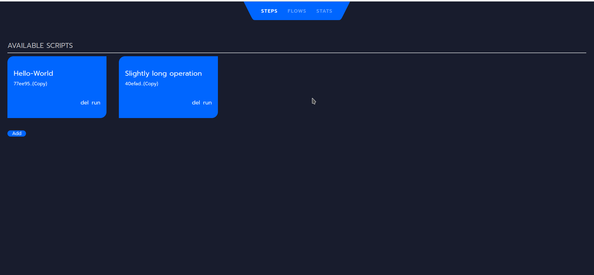
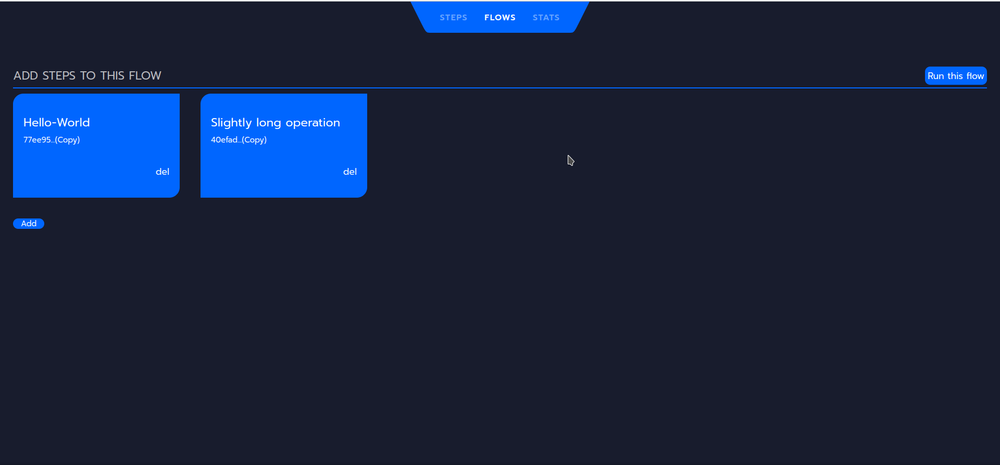
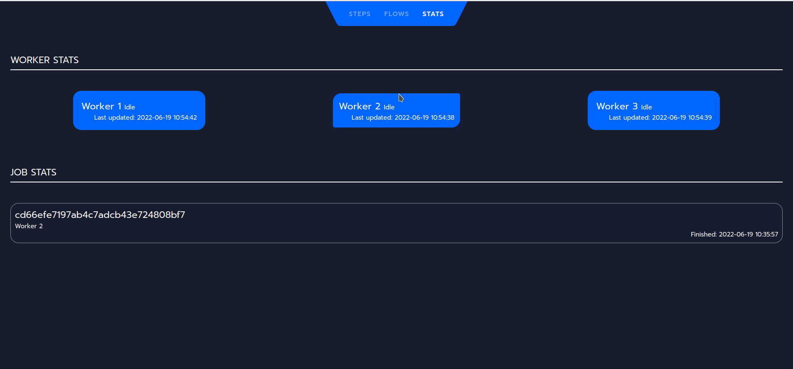

# Mini-windmill

## Execute go programs

### Stack: 
* **Backend**: Rust + MongoDB
* **Frontend**: Svelte

***Note***

This demo lacks unit tests and I have used unwrap() very generously. So things might go wrong.

**Step** (basically scripts/go programs)

 

**Flow** is a list of steps run in a sequence.

 

**Stat** shows the state of the 3 worker threads and the output of a job execution. (Clicking on hash would show the output)

